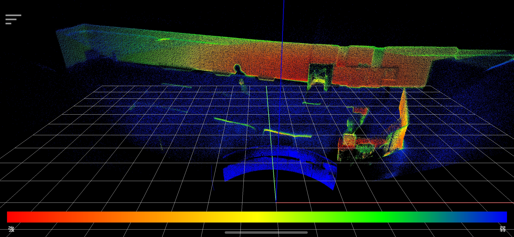
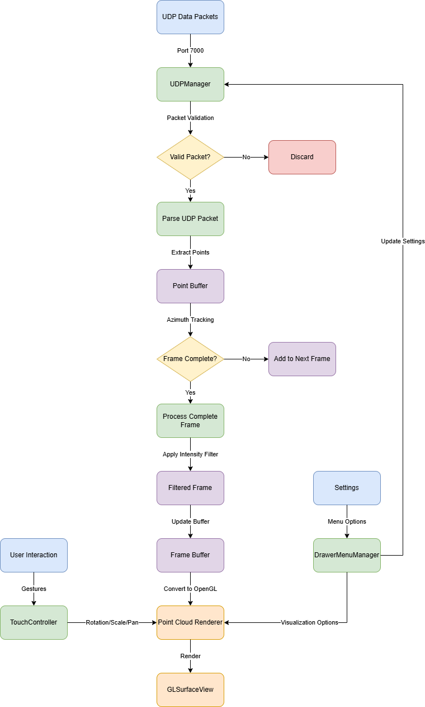

# 點雲瀏覽器 (PointCloud Viewer) Android 應用程式

這是一款功能強大的 Android 應用程式，用於視覺化從 LiDAR 感測器透過 UDP 接收的 3D 點雲數據。本應用具有即時 3D 視覺化界面和手勢控制功能，讓用戶能夠互動式查看點雲數據。



## 功能特點

- **即時點雲視覺化**：渲染從 LiDAR 感測器串流的 3D 點雲數據

- 高效數據處理：

    - 在 7000 端口接收 UDP 數據
    - 支持多種 Echo 模式（1st Echo、2nd Echo、All Echoes）
    - 智能幀邊界檢測和重建算法
    - 高效數據過濾和處理機制

- 互動式查看控制：

    - 捏合手勢縮放（雙指）
    - 單指旋轉
    - 三指平移
    - 雙擊重置視圖
    - **長按顯示點詳細資訊**（新增功能）

- 視覺化選項：

    - 切換座標軸顯示
    - 切換網格線顯示
    - 基於強度的著色
    - 控制點顯示比例
    - 強度過濾功能

- 使用者界面：

    - 抽屜式選單進行設置
    - 強度圖例顯示色彩漸變
    - 全屏沉浸式視圖
    - 支持橫屏顯示模式
    - **點選顯示距離和強度資訊**（新增功能）

## 技術架構

### 原生組件 (Kotlin)

- 主要界面與控制：

    - `MainActivity.kt`：主要入口點和 UI 控制器
    - `DrawerMenuManager.kt`：管理設置抽屜 UI
    - `LegendView.kt`：用於顯示強度色彩圖例的自定義視圖

- 點雲處理與渲染：

    - `PointCloudRenderer.kt`：基於 OpenGL ES 2.0 的 3D 點雲視覺化渲染器
    - `UDPManager.kt`：管理 UDP 套接字通訊和數據處理
    - `TouchController.kt`：處理視圖操作的手勢識別和長按事件

### 數據處理流程

下圖展示了 LiDAR 數據從接收到渲染的完整處理流程：



### 數據處理機制

- 幀識別與處理：

    - 智能角度和深度檢測演算法
    - 高效的數據包解析與合併
    - 支持多回波模式 (Echo Mode) 數據處理

- 數據優化：

    - 使用查找表 (lookup table) 進行角度校準
    - 記憶體池和緩衝區管理
    - 數據量動態調整機制

- 點選識別：

    - 射線檢測算法找尋最近點
    - 提供實時距離和強度數據
    - 長按顯示點詳細信息
    - 實現操作間保護期避免誤觸發

## 系統需求

- Android 8.0 (API level 26) 或更高版本
- 支援 OpenGL ES 2.0 的設備
- 接收 UDP 數據的網絡連接

## 使用方法

1. **啟動應用程式**：應用程式將自動開始在 7000 端口監聽 UDP 數據包

2. 視圖控制：

    - 旋轉：用一根手指觸摸並拖曳
    - 縮放：用兩根手指進行捏合
    - 平移：用三根手指觸摸並拖曳
    - 重置視圖：在螢幕上任意位置雙擊
    - **查看點詳情**：長按點雲中的任意位置顯示最接近點的距離和強度

3. 設置：點擊左上角的漢堡圖標進入選單

    - 切換坐標軸和網格線顯示
    - 調整點顯示比例以優化性能
    - 切換強度過濾功能
    - 選擇 Echo Mode (1st、2nd、All)
    - 切換強度圖例顯示

## 技術細節

### UDP 協議格式

本應用程式設計用於處理具有以下格式的 LiDAR 數據包：

- 數據包大小：816 位元組
- 標頭大小：32 位元組
- 數據大小：784 位元組
- 標頭魔術碼：`0x55, 0xaa, 0x5a, 0xa5`
- 上下包區分：使用 PACKET_UPPER (0x10) 和 PACKET_LOWER (0x20) 做識別
- Echo 區分：使用 ECHO_1ST (0x01) 和 ECHO_2ND (0x02) 做識別

### 幀邊界檢測

- 方位角跳變識別：從接近 360° 到接近 0° 的角度轉變
- 角度閾值：使用精確的起始角度閾值 (2°) 和結束角度閾值 (358°)
- 角度跳變閾值：設定下限 (60°) 和上限 (300°) 確保穩定檢測
- 有效點比率：使用最小有效點比率 (50%) 避免噪聲影響

### 性能優化

- 多線程處理，使用隊列管理確保視覺化流暢
- 幀邊界檢測實現精確的點雲重建
- 數據包配對邏輯確保完整的掃描線
- 預先記憶體分配以減少垃圾回收
- 強度過濾功能可控制顯示點的數量
- 使用查找表加速角度計算

### 視覺化技術

- 坐標系統：右手系，Y 軸向上
- 著色：基於強度的漸變，從藍色（低）到紅色（高）
- 深度測試確保正確遮擋
- 點大小調整以獲得最佳可見度
- 網格和座標軸輔助顯示
- 射線投射技術實現點選識別

### 點選識別與顯示

- 使用射線投射 (Ray Casting) 技術將 2D 螢幕點擊轉換為 3D 空間中的射線
- 計算射線與點雲中各點的距離，找出最近點
- 顯示所選點的實際距離（從原點）及強度值
- 使用矩陣變換計算確保準確性
- 信息顯示在屏幕右上角 FPS 計數器下方

## 開發

### 專案結構

```
app/
├── src/
│   ├── main/
│   │   ├── java/com/example/pointcloudviewer/
│   │   │   ├── MainActivity.kt            // 主Activity
│   │   │   ├── PointCloudRenderer.kt      // 點雲渲染器
│   │   │   ├── UDPManager.kt              // UDP管理器
│   │   │   ├── TouchController.kt         // 觸控控制器
│   │   │   ├── DrawerMenuManager.kt       // 選單管理器
│   │   │   └── LegendView.kt              // 圖例視圖
│   │   ├── res/
│   │   │   ├── layout/
│   │   │   ├── raw/
│   │   │   │   └── lookup_table.txt       // 角度校準查找表
│   │   │   └── values/
│   │   └── AndroidManifest.xml
└── build.gradle
```

### 構建專案

1. 克隆儲存庫
2. 在 Android Studio 中打開專案
3. 在兼容設備或模擬器上構建和運行

## 授權

MIT

## 致謝

- 本應用程式使用優化的 UDP 數據包處理技術處理 LiDAR 數據
- 包含專門的查找表進行角度校準
- 使用 OpenGL ES 實現高效 3D 渲染
- 利用射線投射技術實現點選識別

## 聯絡

Dylan_Lin
